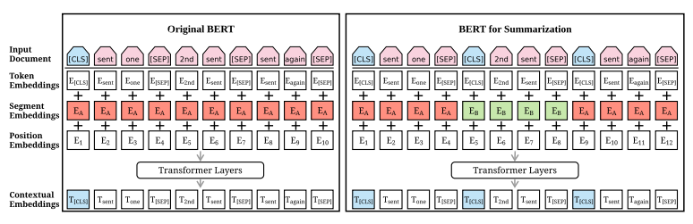
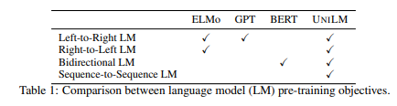
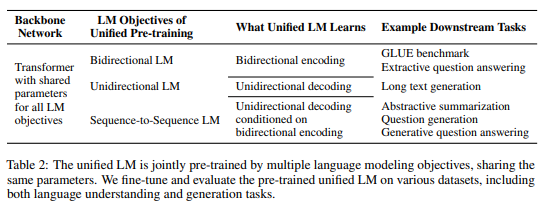
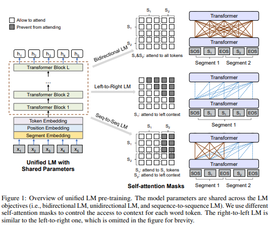
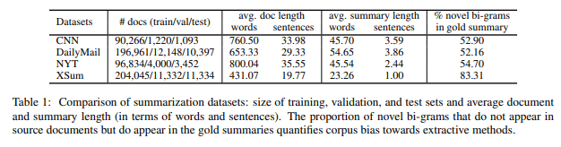

# DS8008 Final Project - Abstractive Text Summarization Using BERT
**Group 1 - Greg Araujo and Anthony Ionno**

## Project Overview

Group 1 proposes to replicate the abstractive text summarization results of one or more than one of the following five papers using the CNN/Daily Mail dataset:

1. ProphetNet: Predicting Future N-gram for Sequence-to-Sequence Pre-training
2. Unified Language Model Pre-training for Natural Language Understanding and Generation
3. Text Summarization with Pretrained Encoders
4. Mixture Content Selection for Diverse Sequence Generation
5. Get To The Point: Summarization with Pointer-Generator Networks

Each paper and its codebase can be located at the following link:
https://paperswithcode.com/sota/abstractive-text-summarization-on-cnn-daily

The papers are ordered in terms of recency and score performance, the machine learning model in (1) outperforms all the models below it in terms of various text summarization metrics.
 
Group 1 may lack the appropriate resources to fully replicate the results for any of the papers above, in which case, an alternative approach may be required (e.g., use a smaller dataset).

In addition to this Group 1 will create a sample dataset of news articles that are more current and test whether a pre-trained abstractive summarization model is capable of capturing more current news information.

## Introduction

Given the amount of information available to us throughout the day, it is very easy to feel overwhelmed by it all and feel as though relevant pieces of information have been missed. While it may feel as though it has become more as a result of the way we consume information today, previous studies indicate that this problem has existed for decades. A study in 1966 by Dr. Jack B. Haskins had asked if an analyst needed to read the whole item for accurate classification or would it be sufficient enough to read the headline and lead paragraph to obtain an accurate reflection of an item’s subject matter[1].  As time has passed this problem has not gone away and feels as though it has only gotten worse. For this reason, automatic text summarization – the task of automatically condensing a piece of text to a shorter version – is becoming increasingly vital. [2]

Today, text summarization is a popular research topic in natural language processing (NLP) and has its applications in almost all domains of the internet from product descriptions, search engines and to news websites. 

Text summarization can be classified into 2 approaches, extractive and abstractive. Extractive approaches select passages from the source text, then arrange them to form a summary. You might think of these approaches as like a highlighter. Abstractive approaches use natural language generation techniques to write novel sentences [2].

Neural abstractive summarization, Rush et al. (2015) were the first to apply modern neural networks to abstractive text summarization, achieving state-of-the-art performance on DUC-2004 and Gigaword, two sentence-level summarization datasets [3]. See et al. (2017) created a Sequence-to-sequence Model with Attention for Text Summarization outperforming the current abstractive state-of-the-art by at least 2 ROUGE points [3]. Since these papers were published, others have used sequence based models such as Unified Language Model Pre-training for Natural Language Understanding and Generation (UniLM) (2019)
and Text Summarization with Pretrained Encoders (2019) to improve upon previous ROUGE benchmarks. 

**In this project we have implemented a pre-trained BERT model.** 


## Background

Recurrent Neural Networks (RNN) have proven to be very effective in tackling abstractive text generation. RNNs are a class of neural networks that are designed to address challenges with N-gram models and traditional language models by dealing directly with the temporal aspect of language. RNNs can handle variable length inputs without the use of arbitrary fixed-sized windows, while providing the means to capture and exploit the temporal nature of language [4].

Plenty of research papers have been published to date. In this project we will look at Text Summarization with Pretrained Encoders, Liu & Lapata (2019) and Unified Language Model Pre-training for Natural Language Understanding and Generation (UniLM) Dong et al (2019). 

### Text Summarization with Pretrained Encoders

source : https://arxiv.org/pdf/1908.08345v2.pdf

#### Summary 

The research paper itself is an extension of the original Bidirectional Encoder Representations from Transformers (BERT; Devlin et al. 2019). The paper describes how the BERT framework can be applied for both extractive and abstractive text summarization models. The researchers also introduce a novel document-level encoder based on BERT which is able to express the semantics of a document and obtain representations for its sentences [5]. 

The model itself is unique in that it goes through a 2 stage encoder where the encoder is fine-tuned twice. It goes through an extractive objective first, followed by an abstractive summarization task [5]. 

The extractive model utilizes the novel decoder by stacking several intersentence transformer layers to capture document level features for extracting sentences.
The abstractive model then adopts an encoder-decoder architecture, combining the same pretrained BERT encoder with a randomly-initialized Transformer decoder.

In order to realize the advantages of the novel approach, a new training schedule was implemented that separates the optimizers of the encoder and the decoder in order to accommodate. This was done so as to separate that the encoder was already pre trained and the decoder must be trained from scratch [5].

As per the researchers, pretrained language models have emerged as a key technology for achieving impressive gains in a wide variety of natural language tasks. These models extend the idea of word embeddings by learning contextual representations from large-scale corpora using a language modeling objective. Bidirectional Encoder Representations from Transformers (BERT) is a new language representation model which is trained with a masked language modeling and a “next sentence prediction” task on a corpus of 3,300M words [5].

#### Architecture



The Architecture of the original BERT model (left) and BERTSUM (right). The sequence on top is the input document, followed by the summation of three kinds of embeddings for each token. 

Token embeddings : The meaning of each token
Segmentation embeddings : Discriminate between two sentences (e.g., during a sentence-pair classification task)
Position embeddings : Indicate the position of each token within the text sequence.

The summed vectors are used as input embeddings to several bidirectional Transformer layers, generating contextual vectors for each token. BERTSUM extends BERT by inserting multiple [CLS] symbols to learn sentence representations and using interval segmentation embeddings (illustrated in red and green color) to distinguish multiple sentences [5].

### Unified Language Model Pre-training for Natural Language Understanding and Generation (UNILM)

Source : https://arxiv.org/pdf/1905.03197v3.pdf

#### Summary

UNILM is a multi-layer Transformer network, jointly pre-trained on large amounts of text, optimized for three types of unsupervised language modeling objectives. Similar to BERT, the pre-trained UNILM can be fine-tuned (with additional task-specific layers if necessary) to adapt to various downstream tasks [6].

The researchers claim that UNiLM has three main advantages over other pretrained models such as BERT. 

* The unified pre-training procedure leads to a single transformer language model  that uses the shared parameters and architecture for different types of language models. This alleviates the need to separately train and host multiple language models (see table below to see additional use cases).



* The parameter sharing makes the learned text representations more general because they are jointly optimized for different language modeling objectives where context is utilized in different ways, mitigating overfitting to any single LM task (see table below for comparison).



* Whereas the researchers who wrote Text Summarization for Pretrained Encoders, repurposed BERT for abstractive text summarization. The sequence-to-sequence language model created by UNILM, is specifically designed for natural language generation tasks such as abstractive summarization and question generation [6].




The model parameters are shared across the language model objectives (i.e., bidirectional LM, unidirectional LM, and sequence-to-sequence LM). The model uses different self-attention masks to control the access to context for each word token. The output vectors are then used by the transformer network with a softmax classifier to predict the masked token [6]. 

## Methodology

Although BERT has been used to fine-tune various NLP tasks, its application to summarization is not as straightforward.

In order to distinguish sentences within a piece of text, external [CLS] tokens are inserted at the start of each sentence. Each [CLS] symbol collects features for the sentence preceding it. Interval segment embeddings are also used to distinguish multiple sentences within a document. For senti we assign segment embedding EA or EB depending on whether i is odd or even. For example, for document [sent1, sent2, sent3, sent4, sent5], we would assign embeddings [EA, EB, EA, EB, EA] [5].

Extractive summarization within the model is responsible for  assigning a label yi ∈ {0, 1} to each senti. The purpose is to indicate whether the sentence should be included in the summary.  Several inter-sentence transformer layers are then stacked on top of BERT outputs, to capture document-level features for extracting summaries. The final output layer is a sigmoid classifier and the loss of the model is the binary classification entropy of prediction yˆi against gold label yi [5].

For abstractive summarization, the paper implements a standard encoder-decoder framework. The encoder is pre-trained on the revised architecture (BERTSUM) and the decoder is a 6-layered transformer initialized randomly [5]. 

When predicting summaries for a new document, the model obtains a score for each sentence. The sentences are then ranked by their scores from highest to lowest, and then the top 3 sentences are selected as the summary [5]. 


## Implementation

### Dataset

The model is trained on the CNN/Daily Mail dataset. See below for basic statistics about the dataset. 



### Code repository 

https://github.com/huggingface/transformers/tree/master/examples/summarization/bertabs

Additional comments have been included within run_summarization.py, modeling_bertabs.py scripts.

## Results 

### Metric Scores

#### CNN/Daily News sample dataset
As part of this project Group 1 was able to run a sample of the CNN/Daily News dataset and output the following text summarization metrics:

|| ROUGE-1 | ROUGE-2 | ROUGE-L |
|:---| :---:          |     :---:      |          :---: |
|**F1**| 0.29     | 0.165       | 0.313      |
|**Precision**| 0.318   | 0.196     | 0.338    |
|**Recall**| 0.273     | 0.149       | 0.297      |

#### Group 1 sample news dataset
Group 1 also ran a similar analysis using its own novel dataset, with the following text summarization metric scores:

|| ROUGE-1 | ROUGE-2 | ROUGE-L |
|:---| :---:          |     :---:      |          :---: |
|**F1**| 0.105    | 0.015       | 0.131      |
|**Precision**| 0.106  | 0.015     | 0.132    |
|**Recall**| 0.104     | 0.015       | 0.130     |

#### Results from paper 'Text Summarization with Pretrained Encoders'

|| ROUGE-1 | ROUGE-2 | ROUGE-L |
|:---| :---:          |     :---:      |          :---: |
|**F1**| 0.421    | 0.196       | 0.391      |

### Examples of abstractive summary text output

#### CNN/Daily News sample dataset

##### Article 1

* **Article highlight** - London Fire Brigade turned out to 79 incidents involving handcuffs and nine instances of men with rings stuck on their penises
* **Article highlight** - Each incident costs the taxpayer at least £290 and fire crews are warning the public to 'always keep the keys handy'
    * **What BERT produced** - firefighters say popularity of 50 shades of grey has sparked a surge in people getting trapped in handcuffs. they are increasingly being called out to free people handcuffed to beds

##### Article 2

* **Article highlight** - Mount Tongariro takes scientists by surprise by suddenly erupting for the first time since 1897
* **Article highlight** - People evacuated, roads closed and flights cancelled as thick ash spreads over several miles
* **Article highlight** - Witnesses describe flashes and explosions followed by ash cloud reaching more than four miles high
* **Article highlight** - Mountain lies in national park used as backdrop to Peter Jackson's The Lord of the Rings films
    * **What BERT produced** - volcano suddenly erupted for the first time in more than a century. witness described flashes and followed explosions. volcano has covered parts of new zealand 's north island

#### Group 1 sample news dataset

##### Article 1

* **Article highlight** - Bernie Sanders throws support behind former Democrat rival Joe Biden
    * **What BERT produced** - sanders joined biden in an online campaign event , citing the coronavirus outbreak as a reason for the party to come together. the two appeared side--by-side on biden 's campaign website. the progressive firebrand who last week suspended his presidential campaign last week had declared that he saw no viable path to the presidential nomination. he called sanders the most powerful voice around a fair and more just america.

##### Article 2

* **Article highlight** - Forest fires that have been burning for several days in northern Ukraine are now no more than a few kilometres from the abandoned Chernobyl nuclear plant, reports say.
    * **What BERT produced** - more than 300 firefighters with dozens of pieces of special hardware are working at the site , while six helicopters and planes are attempting to extinguish the fire from above. chernobyl nuclear power station and nearby town of pripyat have been abandoned since 1986 , when the plant 's no. 4 reactor blew up

## Analysis

### BERT Code for CNN/Daily Mail Sample Dataset


```python
!python bertabs/run_summarization.py --documents_dir="D:\bert_data"\
--summaries_output_dir="D:/summary"\
--no_cuda=false --batch_size=5 --min_length=10\
--max_length=500 --beam_size=5 --alpha=0.95\
--block_trigram=true --compute_rouge=true
```

    INFO:transformers.tokenization_utils:loading file https://s3.amazonaws.com/models.huggingface.co/bert/bert-base-uncased-vocab.txt from cache at C:\Users\Tony Joe\.cache\torch\transformers\26bc1ad6c0ac742e9b52263248f6d0f00068293b33709fae12320c0e35ccfbbb.542ce4285a40d23a559526243235df47c5f75c197f04f37d1a0c124c32c9a084
    INFO:transformers.configuration_utils:loading configuration file https://s3.amazonaws.com/models.huggingface.co/bert/remi/bertabs-finetuned-cnndm-extractive-abstractive-summarization/config.json from cache at C:\Users\Tony Joe\.cache\torch\transformers\9d982039993bba60a064b70f3d5733f091aefc83eef2f1cd222242ca2f4fd0d9.c3ca02f3f42c25433be972663dafb463df23976fd811cdae89d87c8c4d74ab40
    INFO:transformers.configuration_utils:Model config BertAbsConfig {
      "_num_labels": 2,
      "architectures": [
        "BertForMaskedLM"
      ],
      "bos_token_id": null,
      "dec_dropout": 0.2,
      "dec_ff_size": 2048,
      "dec_heads": 8,
      "dec_hidden_size": 768,
      "dec_layers": 6,
      "decoder_start_token_id": null,
      "do_sample": false,
      "early_stopping": false,
      "enc_dropout": 0.2,
      "enc_ff_size": 512,
      "enc_heads": 8,
      "enc_hidden_size": 512,
      "enc_layers": 6,
      "eos_token_id": null,
      "finetuning_task": null,
      "id2label": {
        "0": "LABEL_0",
        "1": "LABEL_1"
      },
      "is_decoder": false,
      "is_encoder_decoder": false,
      "label2id": {
        "LABEL_0": 0,
        "LABEL_1": 1
      },
      "length_penalty": 1.0,
      "max_length": 20,
      "max_pos": 512,
      "min_length": 0,
      "model_type": "bertabs",
      "no_repeat_ngram_size": 0,
      "num_beams": 1,
      "num_return_sequences": 1,
      "output_attentions": false,
      "output_hidden_states": false,
      "output_past": true,
      "pad_token_id": null,
      "prefix": null,
      "pruned_heads": {},
      "repetition_penalty": 1.0,
      "task_specific_params": null,
      "temperature": 1.0,
      "top_k": 50,
      "top_p": 1.0,
      "torchscript": false,
      "use_bfloat16": false,
      "vocab_size": 30522
    }
    
    INFO:transformers.modeling_utils:loading weights file https://s3.amazonaws.com/models.huggingface.co/bert/remi/bertabs-finetuned-cnndm-extractive-abstractive-summarization/pytorch_model.bin from cache at C:\Users\Tony Joe\.cache\torch\transformers\890a77c84d1ce42186dc75b5dabe0ca7a494e1a3f750f66969f091353fa00c5a.f7b70c5121ce72aad107e20f528d8fd88aa9da525c556aeadeab0c0421696223
    INFO:transformers.configuration_utils:loading configuration file https://s3.amazonaws.com/models.huggingface.co/bert/bert-base-uncased-config.json from cache at C:\Users\Tony Joe\.cache\torch\transformers\4dad0251492946e18ac39290fcfe91b89d370fee250efe9521476438fe8ca185.8f56353af4a709bf5ff0fbc915d8f5b42bfff892cbb6ac98c3c45f481a03c685
    INFO:transformers.configuration_utils:Model config BertConfig {
      "_num_labels": 2,
      "architectures": [
        "BertForMaskedLM"
      ],
      "attention_probs_dropout_prob": 0.1,
      "bos_token_id": null,
      "decoder_start_token_id": null,
      "do_sample": false,
      "early_stopping": false,
      "eos_token_id": null,
      "finetuning_task": null,
      "hidden_act": "gelu",
      "hidden_dropout_prob": 0.1,
      "hidden_size": 768,
      "id2label": {
        "0": "LABEL_0",
        "1": "LABEL_1"
      },
      "initializer_range": 0.02,
      "intermediate_size": 3072,
      "is_decoder": false,
      "is_encoder_decoder": false,
      "label2id": {
        "LABEL_0": 0,
        "LABEL_1": 1
      },
      "layer_norm_eps": 1e-12,
      "length_penalty": 1.0,
      "max_length": 20,
      "max_position_embeddings": 512,
      "min_length": 0,
      "model_type": "bert",
      "no_repeat_ngram_size": 0,
      "num_attention_heads": 12,
      "num_beams": 1,
      "num_hidden_layers": 12,
      "num_return_sequences": 1,
      "output_attentions": false,
      "output_hidden_states": false,
      "output_past": true,
      "pad_token_id": 0,
      "prefix": null,
      "pruned_heads": {},
      "repetition_penalty": 1.0,
      "task_specific_params": null,
      "temperature": 1.0,
      "top_k": 50,
      "top_p": 1.0,
      "torchscript": false,
      "type_vocab_size": 2,
      "use_bfloat16": false,
      "vocab_size": 30522
    }
    
    INFO:__main__:***** Running evaluation *****
    INFO:__main__:  Number examples = 100
    INFO:__main__:  Batch size = 5
    INFO:__main__:
    INFO:__main__:***** Beam Search parameters *****
    INFO:__main__:  Beam size = 5
    INFO:__main__:  Minimum length = 10
    INFO:__main__:  Maximum length = 500
    INFO:__main__:  Alpha (length penalty) = 0.95
    INFO:__main__:  Trigrams will be blocked
    
    
    ****** ROUGE SCORES ******
    
    ** ROUGE 1
    F1        >> 0.290
    Precision >> 0.318
    Recall    >> 0.273
    
    ** ROUGE 2
    F1        >> 0.165
    Precision >> 0.196
    Recall    >> 0.149
    
    ** ROUGE L
    F1        >> 0.313
    Precision >> 0.338
    Recall    >> 0.297
    

    [nltk_data] Downloading package punkt to C:\Users\Tony
    [nltk_data]     Joe\AppData\Roaming\nltk_data...
    [nltk_data]   Package punkt is already up-to-date!
    
      0%|          | 0/20 [00:00<?, ?it/s]
      5%|5         | 1/20 [00:45<14:17, 45.11s/it]
     10%|#         | 2/20 [01:29<13:27, 44.86s/it]
     15%|#5        | 3/20 [02:23<13:32, 47.79s/it]
     20%|##        | 4/20 [03:11<12:41, 47.57s/it]
     25%|##5       | 5/20 [03:53<11:29, 45.99s/it]
     30%|###       | 6/20 [04:44<11:06, 47.63s/it]
     35%|###5      | 7/20 [05:32<10:20, 47.69s/it]
     40%|####      | 8/20 [06:13<09:06, 45.51s/it]
     45%|####5     | 9/20 [06:58<08:20, 45.47s/it]
     50%|#####     | 10/20 [07:50<07:52, 47.30s/it]
     55%|#####5    | 11/20 [08:40<07:13, 48.15s/it]
     60%|######    | 12/20 [09:24<06:14, 46.86s/it]
     65%|######5   | 13/20 [10:20<05:48, 49.81s/it]
     70%|#######   | 14/20 [11:16<05:10, 51.69s/it]
     75%|#######5  | 15/20 [12:09<04:20, 52.07s/it]
     80%|########  | 16/20 [12:52<03:17, 49.37s/it]
     85%|########5 | 17/20 [13:46<02:31, 50.52s/it]
     90%|######### | 18/20 [14:26<01:35, 47.60s/it]
     95%|#########5| 19/20 [15:11<00:46, 46.82s/it]
    100%|##########| 20/20 [16:12<00:00, 50.88s/it]
    100%|##########| 20/20 [16:12<00:00, 48.61s/it]
    

### BERT code for sample dataset produced by group 1


```python
!python bertabs/run_summarization.py --documents_dir="D:\bert_summary\new dataset"\
--summaries_output_dir="D:/summary"\
--no_cuda=false --batch_size=5 --min_length=10\
--max_length=500 --beam_size=5 --alpha=0.95\
--block_trigram=true --compute_rouge=true
```

    INFO:transformers.tokenization_utils:loading file https://s3.amazonaws.com/models.huggingface.co/bert/bert-base-uncased-vocab.txt from cache at C:\Users\Tony Joe\.cache\torch\transformers\26bc1ad6c0ac742e9b52263248f6d0f00068293b33709fae12320c0e35ccfbbb.542ce4285a40d23a559526243235df47c5f75c197f04f37d1a0c124c32c9a084
    INFO:transformers.configuration_utils:loading configuration file https://s3.amazonaws.com/models.huggingface.co/bert/remi/bertabs-finetuned-cnndm-extractive-abstractive-summarization/config.json from cache at C:\Users\Tony Joe\.cache\torch\transformers\9d982039993bba60a064b70f3d5733f091aefc83eef2f1cd222242ca2f4fd0d9.c3ca02f3f42c25433be972663dafb463df23976fd811cdae89d87c8c4d74ab40
    INFO:transformers.configuration_utils:Model config BertAbsConfig {
      "_num_labels": 2,
      "architectures": [
        "BertForMaskedLM"
      ],
      "bos_token_id": null,
      "dec_dropout": 0.2,
      "dec_ff_size": 2048,
      "dec_heads": 8,
      "dec_hidden_size": 768,
      "dec_layers": 6,
      "decoder_start_token_id": null,
      "do_sample": false,
      "early_stopping": false,
      "enc_dropout": 0.2,
      "enc_ff_size": 512,
      "enc_heads": 8,
      "enc_hidden_size": 512,
      "enc_layers": 6,
      "eos_token_id": null,
      "finetuning_task": null,
      "id2label": {
        "0": "LABEL_0",
        "1": "LABEL_1"
      },
      "is_decoder": false,
      "is_encoder_decoder": false,
      "label2id": {
        "LABEL_0": 0,
        "LABEL_1": 1
      },
      "length_penalty": 1.0,
      "max_length": 20,
      "max_pos": 512,
      "min_length": 0,
      "model_type": "bertabs",
      "no_repeat_ngram_size": 0,
      "num_beams": 1,
      "num_return_sequences": 1,
      "output_attentions": false,
      "output_hidden_states": false,
      "output_past": true,
      "pad_token_id": null,
      "prefix": null,
      "pruned_heads": {},
      "repetition_penalty": 1.0,
      "task_specific_params": null,
      "temperature": 1.0,
      "top_k": 50,
      "top_p": 1.0,
      "torchscript": false,
      "use_bfloat16": false,
      "vocab_size": 30522
    }
    
    INFO:transformers.modeling_utils:loading weights file https://s3.amazonaws.com/models.huggingface.co/bert/remi/bertabs-finetuned-cnndm-extractive-abstractive-summarization/pytorch_model.bin from cache at C:\Users\Tony Joe\.cache\torch\transformers\890a77c84d1ce42186dc75b5dabe0ca7a494e1a3f750f66969f091353fa00c5a.f7b70c5121ce72aad107e20f528d8fd88aa9da525c556aeadeab0c0421696223
    INFO:transformers.configuration_utils:loading configuration file https://s3.amazonaws.com/models.huggingface.co/bert/bert-base-uncased-config.json from cache at C:\Users\Tony Joe\.cache\torch\transformers\4dad0251492946e18ac39290fcfe91b89d370fee250efe9521476438fe8ca185.8f56353af4a709bf5ff0fbc915d8f5b42bfff892cbb6ac98c3c45f481a03c685
    INFO:transformers.configuration_utils:Model config BertConfig {
      "_num_labels": 2,
      "architectures": [
        "BertForMaskedLM"
      ],
      "attention_probs_dropout_prob": 0.1,
      "bos_token_id": null,
      "decoder_start_token_id": null,
      "do_sample": false,
      "early_stopping": false,
      "eos_token_id": null,
      "finetuning_task": null,
      "hidden_act": "gelu",
      "hidden_dropout_prob": 0.1,
      "hidden_size": 768,
      "id2label": {
        "0": "LABEL_0",
        "1": "LABEL_1"
      },
      "initializer_range": 0.02,
      "intermediate_size": 3072,
      "is_decoder": false,
      "is_encoder_decoder": false,
      "label2id": {
        "LABEL_0": 0,
        "LABEL_1": 1
      },
      "layer_norm_eps": 1e-12,
      "length_penalty": 1.0,
      "max_length": 20,
      "max_position_embeddings": 512,
      "min_length": 0,
      "model_type": "bert",
      "no_repeat_ngram_size": 0,
      "num_attention_heads": 12,
      "num_beams": 1,
      "num_hidden_layers": 12,
      "num_return_sequences": 1,
      "output_attentions": false,
      "output_hidden_states": false,
      "output_past": true,
      "pad_token_id": 0,
      "prefix": null,
      "pruned_heads": {},
      "repetition_penalty": 1.0,
      "task_specific_params": null,
      "temperature": 1.0,
      "top_k": 50,
      "top_p": 1.0,
      "torchscript": false,
      "type_vocab_size": 2,
      "use_bfloat16": false,
      "vocab_size": 30522
    }
    
    INFO:__main__:***** Running evaluation *****
    INFO:__main__:  Number examples = 17
    INFO:__main__:  Batch size = 5
    INFO:__main__:
    INFO:__main__:***** Beam Search parameters *****
    INFO:__main__:  Beam size = 5
    INFO:__main__:  Minimum length = 10
    INFO:__main__:  Maximum length = 500
    INFO:__main__:  Alpha (length penalty) = 0.95
    INFO:__main__:  Trigrams will be blocked
    
    
    ****** ROUGE SCORES ******
    
    ** ROUGE 1
    F1        >> 0.105
    Precision >> 0.106
    Recall    >> 0.104
    
    ** ROUGE 2
    F1        >> 0.015
    Precision >> 0.015
    Recall    >> 0.015
    
    ** ROUGE L
    F1        >> 0.131
    Precision >> 0.132
    Recall    >> 0.130
    

    [nltk_data] Downloading package punkt to C:\Users\Tony
    [nltk_data]     Joe\AppData\Roaming\nltk_data...
    [nltk_data]   Package punkt is already up-to-date!
    
      0%|          | 0/4 [00:00<?, ?it/s]
     25%|##5       | 1/4 [00:50<02:32, 50.71s/it]
     50%|#####     | 2/4 [01:46<01:44, 52.36s/it]
     75%|#######5  | 3/4 [02:35<00:51, 51.23s/it]
    100%|##########| 4/4 [02:54<00:00, 41.43s/it]
    100%|##########| 4/4 [02:54<00:00, 43.52s/it]
    

## Conclusion and Future Directions

Given that other frameworks such as UNILM can be used for multiple tasks within natural language understanding such as abstractive text summarization and natural language generation tasks such as question answering and question generation. It would be interesting to see if the same tasks can be applied to the BERT framework. 


## References 

1. Dr. Jack B Hoskins. Headline-and-Lead Scanning vs. Whole-Item Reading in Newspaper Content Analysis. Journalism Quarterly, Volume: 43 issue: 2, page(s): 333-335.

2. Abigail See. Taming Recurrent Neural Networks for Better Summarization. http://www.abigailsee.com/2017/04/16/taming-rnns-for-better-summarization.html

3. Abigail See, Peter J. Liu, and Christopher D. Manning. Get To The Point: Summarization With
Pointer-Generator Networks. arXiv preprint arXiv:1704.04368, 2019.

4. Daniel Jurafsky and James H. Martin. Speech and Language Processing, 2nd edition
2008. Chapter 9 : Sequence Processing with Recurrent Networks

5. Yang Liu and Mirella Lapata. Text Summarization With Pretrained Encoders. arXiv preprint arXiv:1908.08345v2, 2019.

6. Li Dong, Nan Yang, Wenhui Wang, Furu Wei, Xiaodong Liu, Yu Wang, Jianfeng Gao, Ming
Zhou, and Hsiao-Wuen. Unified Language Model Pre-training for Natural Language Understanding and Generation. arXiv preprint arXiv:1905.03197


```python

```
